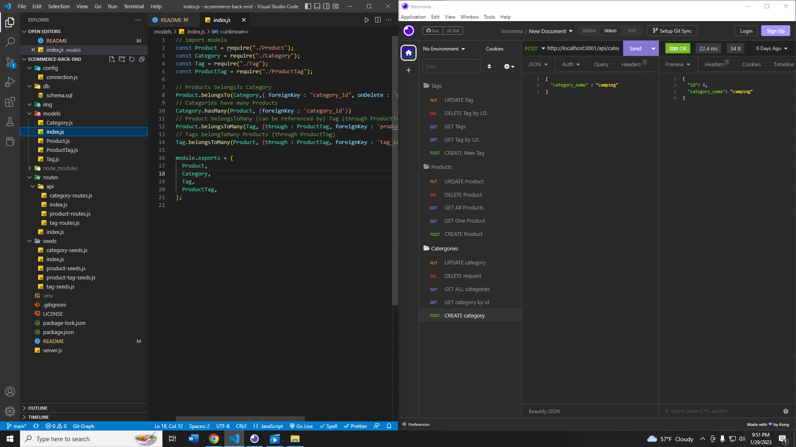

# <u>**Week 13 Challenge**</u>
This weeks challenge focused on being able to use 

## <u>**Motivation**</u>
Here is a list of my motivations for this project!

- learn how to properly use routes to be able to GET POST PUT and DELETE information.
- utilizing Sequelize to handle all my SQL tasks
- fine tone my ability to read starter code and form routes based off it

## <u>**Screenshots**</u>

## <u>**Recording**</u>

[Untitled_ Jan 29, 2023 9_47 PM.webm](https://user-images.githubusercontent.com/113783273/215381003-39f2e5d1-cd2c-46c4-aa3a-1bf64f73556a.webm)

## <u>**Author**</u>

Tyler Walton  
Tylerwalton300@gmail.com
